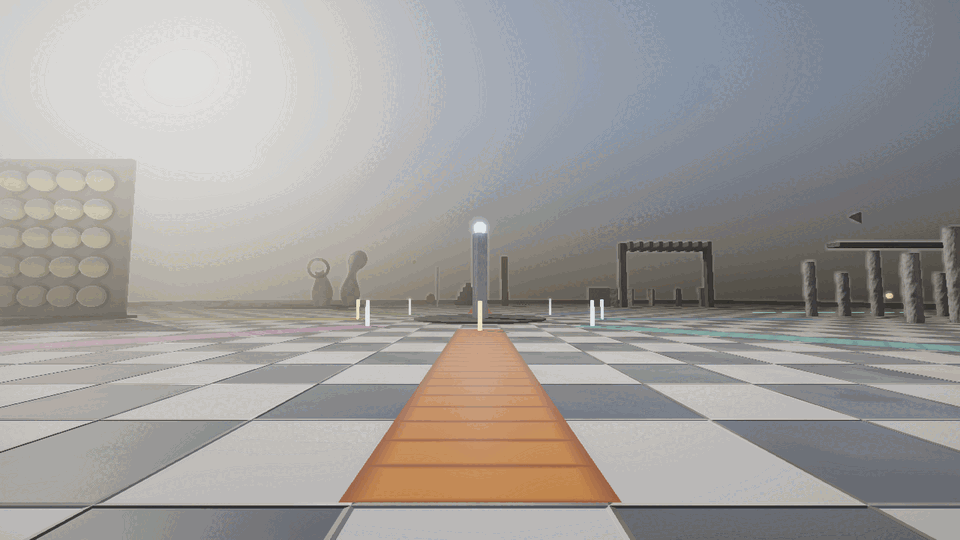
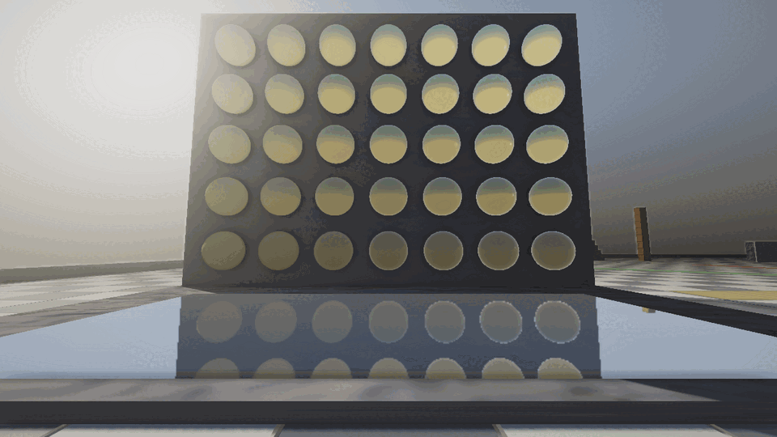
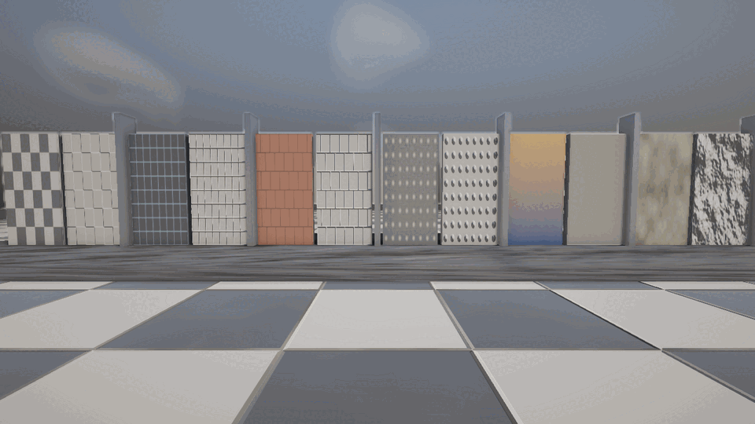

# SAGE Showcase — витрина движка

Демо-проект: платформа со «шахматным» полом и восемью участками, по которым
ходят от первого лица. На каждом участке работает одна сторона движка, и с
каждым можно что-то сделать.

Проект целиком на скриптах: ни строчки C++. Пол, участки, ходьба, интерфейс,
переключатели рендера — всё это Lua поверх обычного ECS движка. Ровно то, что
должно получаться у игры, написанной снаружи.



Слева — стенд материалов, в центре обелиск с дорожками к участкам, справа —
арка объёмного света и колоннада. Клетка пола ровно два метра.

| | |
|---|---|
|  |  |
| Сетка металл/шероховатость и плоское отражение под ней | Шесть узоров парами «цвет / рельеф» |

## Запуск

```bash
# из каталога сборки движка
./runtime/SagePlayer <путь>/games/showcase

# автопрогон без рук: обходит все участки, жмёт на каждом E и R, пишет итог
./runtime/SagePlayer <путь>/games/showcase --autopilot=1 --quit=1
```

Полезные параметры запуска:

| параметр | зачем |
|---|---|
| `--at=x,y,z` | поставить игрока в точку (для снимков) |
| `--look=yaw,pitch` | и повернуть его туда, куда нужно |
| `--nohud=1` | убрать экран: снимок сцены без прицела и подписей |
| `--autopilot=1` | обход участков без рук |
| `--quit=1` | выйти, когда обход закончен (для CI) |

## Управление

| клавиша | действие |
|---|---|
| WASD, SHIFT, SPACE | идти, бежать, прыжок |
| E | действие текущего участка |
| R | собрать участок заново |
| L | фонарь в руке |
| V | разбор кадра: нормали, шероховатость, тени, каскады, глубина… |
| B | объёмный свет и облака |
| N | блик в объективе |
| F1 | справка со списком участков |
| ESC | меню |

## Участки

| участок | что показывает |
|---|---|
| Физика | стопка, пирамида (трение), маятник на тросе, кукла; E — уронить шар |
| Материалы и отражения | сетка металл/шероховатость 7×5 и зеркальная плита |
| Частицы и эффекты | костёр, дым, эмиттер на движущемся объекте, билборды; E — залп |
| Свет и тени | колоннада, три бегущих источника, прожектор; E — схема света |
| Анимация и движение | скелетный клип, обратная кинематика, кривые интерполяции |
| Небо, объём и солнце | лучи сквозь решётку, облака, блик; E — время суток |
| Логика: события и таймеры | отложенные вызовы, шина событий, сохранение |
| Процедурные текстуры | шесть узоров парами «цвет / рельеф»; E — пересчитать |

## Как это устроено

```
assets/scripts/
  world.lua      точка входа: раскладка, порядок кадра, переключатели рендера
  floor.lua      платформа: одна плоскость с процедурной текстурой
  hub.lua        центр: обелиск и цветные дорожки к участкам
  player.lua     ходьба от первого лица поверх контроллера персонажа движка
  zones.lua      список участков и то, на каком из них игрок
  zone_*.lua     сами участки
  mat.lua        материалы по паре (металличность, шероховатость)
  ui.lua/hud.lua экран: прицел, название участка, счётчик кадра, справка
  autopilot.lua  обход участков без рук
```

Договор участка: обязательны `name`, `about`, `center` и `Build()`;
необязательны `Update(dt, ctx)`, `Use()`, `Reset()`, `Enter()`, `Leave()` и
`Solid(bbox)` — твердь для контроллера персонажа.

## Пол

Пол — ОДНА плоскость с процедурной шахматкой (цвет + карта нормалей на швы +
карта шероховатости из шума), а не сетка из плиток-объектов. Клетка ровно два
метра: по ней меряется вся сцена. Подробности про генератор —
`docs/procedural_textures.md`.
